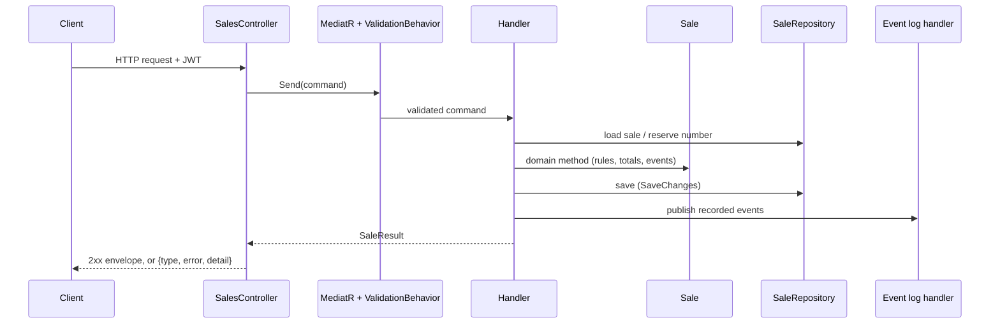
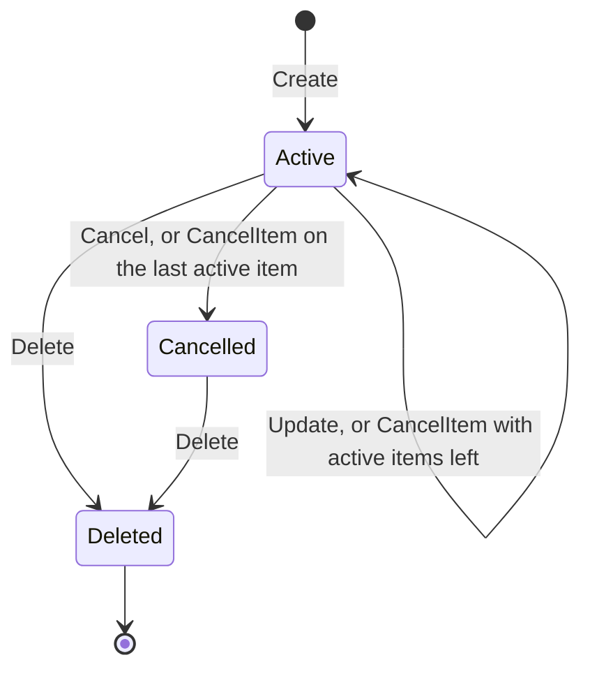

# Sales API — Design Spec

- **Date:** 2026-09-24
- **Status:** Design approved in brainstorming; written spec pending review
- **Challenge:** Ambev DeveloperStore developer evaluation — `.doc/challenge.md` (§9.1)

## 1. Goal

Build a prototype **Sales API** with complete CRUD on the provided .NET 8 template. The quantity-based discount rules live inside a DDD aggregate. The API follows `.doc/general-api.md` (paging, ordering, filtering, error format), requires a JWT, logs four domain events, and ships with unit, integration and functional tests.

## 2. Scope

**In scope**

- Sales: create, get by id, list (paging, ordering, filtering), update, cancel sale, cancel item, soft delete.
- The discount and quantity rules (§5.2).
- Domain events `SaleCreated`, `SaleModified`, `SaleCancelled`, `ItemCancelled`, published after the save and written to the application log.
- JWT on every Sales endpoint, reusing the template's Users and Auth features (fixed where broken).
- The `{type, error, detail}` error format across the whole API.
- Repo restructure to the documented layout, the template fixes in §9.1, a project README, a `.http` file and Swagger Bearer auth.
- Unit, integration (Testcontainers PostgreSQL) and functional (WebApplicationFactory) tests.

**Out of scope**

- The Products and Carts APIs, and the Users/Auth API shapes described in `.doc/*-api.md`. The challenge README comments them out; they serve only as convention references.
- MongoDB, Redis, Rebus or any message broker. Events are logged.
- Role-based authorization. Any authenticated user may call Sales.
- Checking external identities against their source domains.
- Template issues that don't affect Sales, JWT or running the app (§9.2).

## 3. Decisions

| # | Topic | Decision | Why |
|---|---|---|---|
| D1 | Domain style | A rich `Sale` aggregate enforces the rules and records events; handlers stay thin | No code path can skip a rule; rules test without mocks; it's the DDD the challenge asks for |
| D2 | External identities | Customer, branch and product are `ExternalIdentity(Id, Name)` value objects: an id plus a copied name, no foreign key | The challenge's "External Identities" pattern |
| D3 | Quantity 4 | Gets 10% | The README contradicts itself ("above 4" vs "4+ items" and "below 4 cannot have a discount"); two of the three statements discount 4 |
| D4 | Sale number | Optional on create: generated from a PostgreSQL sequence when omitted, checked for uniqueness when sent; never changes | User decision; supports till-issued numbers and ad-hoc creation |
| D5 | Last active item | Cancelling it also cancels the sale | User decision; keeps "an open sale has at least one active item" |
| D6 | PUT and missing lines | Active lines absent from the payload are cancelled, not deleted | User decision; nothing leaves the database, and each removal becomes an `ItemCancelled` event |
| D7 | DELETE | Soft delete (`IsDeleted`, `DeletedAt`) plus a global EF Core query filter | User decision; keeps history with no filter to remember per query |
| D8 | Events | The aggregate records them; handlers publish them through MediatR only after the save succeeds; one handler logs them | The README accepts logging; publishing after the save never announces unsaved changes |
| D9 | Concurrency | Optimistic, on PostgreSQL's `xmin` | Two simultaneous item cancellations would otherwise save totals computed from stale state |
| D10 | Validation | Command validators in Application, run by the template's `ValidationBehavior` once validators are registered; WebApi request DTOs don't validate again | One source of truth; the behavior was registered but never ran |
| D11 | Response formats | Success uses the template envelope `{success, message, data}`; errors use `{type, error, detail}` from `general-api.md` | Matches the existing code and the documented error contract |
| D12 | DTO shape | Flat fields (`customerName`, not `customer.name`) | `general-api.md` filters and orders by JSON field names |
| D13 | Auth | `[Authorize]` on Sales; tokens come from the template's `POST /api/users` and `POST /api/auth` | User decision (the JWT extra) |
| D14 | AutoMapper | Stay on 13.0.1 and document the advisory | Fixes exist only in the commercial 15.1.1+ and 16.1.1+; not exploitable here (§12) |
| D15 | Repo layout | Move `template/backend/*` to the repo root | Matches `.doc/project-structure.md` |
| D16 | Workflow | Git Flow and Conventional Commits; no AI attribution lines anywhere | Graded criteria; user rule |

## 4. Architecture

The template's projects and dependency direction stay as they are. Sales adds these parts:

| Project | Sales work it owns |
|---|---|
| Domain | `Sale`, `SaleItem`, `ExternalIdentity`, `DiscountPolicy`, the domain events, `ISaleRepository`, `ISaleNumberGenerator`, the list-query types (filter, sort, paged result); `DomainException` gains a namespace |
| Application | One folder per use case (command or query, handler, validator), `SaleResult`, the AutoMapper profile, the `_order` parser, the event-publishing helper, the event-logging handler |
| ORM | EF Core mappings, the `AddSales` migration, `SaleRepository`, `SaleNumberGenerator` |
| IoC | Registrations for the repository, the number generator and the validators |
| WebApi | `SalesController`, request and response contracts, the WebApi AutoMapper profile, the exception middleware, JSON, Swagger and JWT-challenge wiring |

A command travels like this:



## 5. Domain model

### 5.1 Types

**`Sale`**: aggregate root; extends the template's `BaseEntity`.

| Member | Type | Notes |
|---|---|---|
| `Id` | `Guid` | Created by the domain when the sale is created |
| `SaleNumber` | `string` | 1–50 characters after trimming; never changes |
| `SaleDate` | `DateTime` | Always UTC |
| `Customer` | `ExternalIdentity` | |
| `Branch` | `ExternalIdentity` | |
| `Items` | `IReadOnlyCollection<SaleItem>` | Backed by a private list |
| `TotalAmount` | `decimal` | Sum of `TotalAmount` over non-cancelled items; stored |
| `IsCancelled` | `bool` | |
| `IsDeleted`, `DeletedAt` | `bool`, `DateTime?` | Soft delete |
| `CreatedAt`, `UpdatedAt` | `DateTime`, `DateTime?` | UTC; every mutation sets `UpdatedAt` |
| `DomainEvents` | `IReadOnlyCollection<IDomainEvent>` | Not stored |

**`SaleItem`**: entity; changes only through `Sale`.

| Member | Type | Notes |
|---|---|---|
| `Id` | `Guid` | Created by the domain |
| `Product` | `ExternalIdentity` | |
| `Quantity` | `int` | 1–20 |
| `UnitPrice` | `decimal` | Above 0, at most 2 decimal places |
| `DiscountPercentage` | `decimal` | 0, 10 or 20 |
| `DiscountAmount` | `decimal` | |
| `TotalAmount` | `decimal` | |
| `IsCancelled` | `bool` | |

**`ExternalIdentity`**: value object with `Id` (a non-empty `Guid`) and `Name` (trimmed, 1–100 characters), compared by value.

**`DiscountPolicy`**: static and dependency-free; `GetDiscountPercentage(int quantity)` implements R1.

**`SaleItemData`**: the input record for create and update: `Product`, `Quantity`, `UnitPrice`.

Invalid input reaching the domain throws `DomainException`. Validators normally catch it first (§6), so this is defence in depth.

### 5.2 Business rules

- **R1 Discount tiers**, per item line with quantity *q*:

  | Quantity | Discount |
  |---|---|
  | *q* < 1 | invalid |
  | 1–3 | 0% |
  | 4–9 | 10% |
  | 10–20 | 20% |
  | *q* > 20 | invalid: "It's not possible to sell above 20 identical items" |

- **R2** The domain always computes the discount. Request contracts have no discount fields.
- **R3 Money** is `decimal`:
  - item gross = *q* × `UnitPrice`
  - `DiscountAmount` = gross × percentage ÷ 100, rounded to 2 decimal places (`MidpointRounding.AwayFromZero`)
  - item `TotalAmount` = gross − `DiscountAmount`
  - sale `TotalAmount` = sum of `TotalAmount` over non-cancelled items
- **R4 Identical items** share a `ProductId`. A sale holds at most one active line per product; a create or update payload that repeats a `ProductId` is rejected.
- **R5** A create payload and a PUT payload each carry at least one item.
- **R6** A non-cancelled sale always has at least one active item. Cancelling its last active item also cancels the sale; the sale total becomes 0.
- **R7** A cancelled sale is read-only: update, cancel and cancel item are rejected. Delete is still allowed.
- **R8** Cancelling a sale leaves item states and `TotalAmount` unchanged, as the historical record.
- **R9** Cancelling an item requires the item to be in the sale (else 404) and still active (else 409). A cancelled item drops out of the total.
- **R10 PUT replaces the header and reconciles items by `ProductId`:**
  - `SaleDate`, `Customer` and `Branch` are replaced.
  - An active line whose product is in the payload gets its quantity, price and name updated, and its discount recalculated.
  - A product with no active line gets a new line. This includes a product whose only line was cancelled.
  - An active line whose product isn't in the payload is cancelled.
  - Cancelled lines are history and never change.
- **R11 Soft delete** sets `IsDeleted` and `DeletedAt`. The sale is hidden everywhere afterwards (404, missing from lists), its items stay in the database, and no event is published.
- **R12 Sale number:**
  - optional on create; leading and trailing spaces are trimmed
  - when omitted, the server generates one (§8.3)
  - when sent, it must be unique across all sales, deleted ones included (else 409); comparison is exact
  - it never changes afterwards
- **R13 Dates:**
  - `SaleDate` is required; a value without an offset is read as UTC, and one with an offset is converted to UTC
  - `CreatedAt` is set on creation
  - `UpdatedAt` is set by every successful mutation (update, cancel, cancel item, delete)
  - `DeletedAt` is set on delete
- **R14** Events are published only after the save succeeds. A failed save publishes nothing.

### 5.3 Operations

| Operation | Rejected when | Effects | Events, in order |
|---|---|---|---|
| `Sale.Create(number, date, customer, branch, items)` | no items; repeated product; quantity outside 1–20 | lines built with discounts; totals; `CreatedAt` | `SaleCreated` |
| `Update(date, customer, branch, items)` | sale cancelled; no items; repeated product; quantity outside 1–20 | header replaced; lines reconciled (R10); totals; `UpdatedAt` | one `ItemCancelled` per cancelled line, then `SaleModified` |
| `Cancel()` | sale already cancelled | `IsCancelled`; `UpdatedAt` | `SaleCancelled` |
| `CancelItem(itemId)` | sale cancelled; item already cancelled | item cancelled; totals; `UpdatedAt`; cancels the sale if no active item remains | `ItemCancelled`, then `SaleCancelled` if the sale was cancelled |
| `Delete()` | never (the handler returns 404 for a deleted sale) | `IsDeleted`, `DeletedAt`, `UpdatedAt` | none |

A PUT publishes `SaleModified` even when nothing changed.



### 5.4 Domain events

Events are records implementing `IDomainEvent`, which extends MediatR's `INotification` and adds `OccurredAt` (UTC, stamped when the aggregate records the event). Domain already references MediatR through Common, so no wrapper types are needed.

| Event | Payload |
|---|---|
| `SaleCreatedEvent` | `SaleId`, `SaleNumber`, `CustomerId`, `BranchId`, `TotalAmount`, `ItemCount`, `OccurredAt` |
| `SaleModifiedEvent` | `SaleId`, `SaleNumber`, `TotalAmount`, `OccurredAt` |
| `SaleCancelledEvent` | `SaleId`, `SaleNumber`, `OccurredAt` |
| `ItemCancelledEvent` | `SaleId`, `SaleNumber`, `ItemId`, `ProductId`, `OccurredAt` |

## 6. Application layer

| Use case | Request | Returns | Handler steps |
|---|---|---|---|
| CreateSale | `CreateSaleCommand` | `SaleResult` | Sale number sent → reject if it exists; omitted → generate. Then `Sale.Create`, save, publish |
| GetSale | `GetSaleQuery` | `SaleResult` | 404 if missing or deleted |
| ListSales | `ListSalesQuery` | paged `SaleResult` | Parse `_order`; query the repository |
| UpdateSale | `UpdateSaleCommand` | `SaleResult` | Load (404), `Update`, save, publish |
| CancelSale | `CancelSaleCommand` | `SaleResult` | Load (404), `Cancel`, save, publish |
| CancelSaleItem | `CancelSaleItemCommand` | `SaleResult` | Load (404); item not in the sale → 404; `CancelItem`, save, publish |
| DeleteSale | `DeleteSaleCommand` | none | Load (404), `Delete`, save |

- **Validation:** each command and query has a FluentValidation validator in its folder. `AddValidatorsFromAssembly` registers them, and the template's `ValidationBehavior` runs them before the handler. A failure throws `ValidationException`, which becomes a 400. The rules:
  - quantity 1–20, with R1's message
  - `UnitPrice` above 0, at most 2 decimal places
  - at least one item; no repeated `ProductId`
  - non-empty ids; names required, 1–100 characters
  - `SaleDate` required
  - a sent `SaleNumber` is 1–50 characters after trimming
  - paging, ordering and range rules (§7.3)
- **Event publishing:** after the repository save returns, the handler publishes each recorded event through MediatR's `IPublisher`, then clears them. A shared helper does this. If the save throws, nothing is published.
- **Event logging:** one notification handler handles all four events. It writes a structured Serilog entry (`Sale event {EventName} published {@Event}`) that stands in for a message broker.
- **Mapping:** an AutoMapper profile maps `Sale` to `SaleResult`, flattening `Customer.Id` into `CustomerId` and so on.
- **Repository contract (`ISaleRepository`):**
  - `GetByIdAsync(id)`: tracked, includes items, respects the soft-delete filter
  - `ExistsBySaleNumberAsync(number)`: ignores the soft-delete filter
  - `CreateAsync(sale)`
  - `UpdateAsync(sale)`: saves the tracked aggregate
  - `ListAsync(query)`: no tracking; returns items and the total count
- **Number generator contract:** `ISaleNumberGenerator.NextAsync()`.

## 7. API contract

### 7.1 Endpoints

Every route below requires `Authorization: Bearer <token>`.

| Method | Route | Purpose | Success |
|---|---|---|---|
| POST | `/api/sales` | Create a sale (`saleNumber` optional) | 201, `Location: /api/sales/{id}`, body = sale |
| GET | `/api/sales/{id}` | Get one sale | 200, sale |
| GET | `/api/sales` | List with paging, ordering and filters | 200, page of sales |
| PUT | `/api/sales/{id}` | Replace the header and reconcile items (R10) | 200, sale |
| PATCH | `/api/sales/{id}/cancel` | Cancel the sale | 200, sale |
| PATCH | `/api/sales/{id}/items/{itemId}/cancel` | Cancel one item (R6 may cancel the sale) | 200, sale |
| DELETE | `/api/sales/{id}` | Soft delete | 200, `{success, message}` |

### 7.2 Contracts

POST body. PUT takes the same body without `saleNumber`; a `saleNumber` sent on PUT is ignored.

```json
{
  "saleNumber": "S-000123",
  "saleDate": "2026-09-24T14:30:00Z",
  "customerId": "3f2b8c1e-1111-4a5b-9c2d-000000000001",
  "customerName": "Maria Silva",
  "branchId": "3f2b8c1e-2222-4a5b-9c2d-000000000002",
  "branchName": "Filial Centro",
  "items": [
    { "productId": "3f2b8c1e-3333-4a5b-9c2d-000000000003", "productName": "Cerveja 350ml", "quantity": 5, "unitPrice": 4.50 }
  ]
}
```

A sale in a response, wrapped in the template envelope:

```json
{
  "success": true,
  "message": "Sale created successfully",
  "data": {
    "id": "7f9c2a44-5555-4d1e-8a3b-000000000010",
    "saleNumber": "S-000123",
    "saleDate": "2026-09-24T14:30:00Z",
    "customerId": "3f2b8c1e-1111-4a5b-9c2d-000000000001",
    "customerName": "Maria Silva",
    "branchId": "3f2b8c1e-2222-4a5b-9c2d-000000000002",
    "branchName": "Filial Centro",
    "totalAmount": 20.25,
    "isCancelled": false,
    "createdAt": "2026-09-24T14:31:02Z",
    "updatedAt": null,
    "items": [
      {
        "id": "7f9c2a44-6666-4d1e-8a3b-000000000011",
        "productId": "3f2b8c1e-3333-4a5b-9c2d-000000000003",
        "productName": "Cerveja 350ml",
        "quantity": 5,
        "unitPrice": 4.50,
        "discountPercentage": 10,
        "discountAmount": 2.25,
        "totalAmount": 20.25,
        "isCancelled": false
      }
    ]
  }
}
```

JSON uses camelCase. Enums are serialized as strings (`JsonStringEnumConverter`), which also lets the Users API accept `"Active"` and `"Admin"`. Responses never include `isDeleted` or `deletedAt`, because deleted sales are never returned.

### 7.3 Listing

Example: `GET /api/sales?_page=1&_size=10&_order="saleDate desc, totalAmount"&customerName=Mar*&_minSaleDate=2026-01-01`

| Parameter | Meaning |
|---|---|
| `_page` | Page number, default 1, at least 1 |
| `_size` | Page size, default 10, 1–100; outside that range is a 400 |
| `_order` | Comma-separated `field [asc\|desc]`, with or without surrounding quotes. Field names and directions are case-insensitive, and direction defaults to `asc`. Fields: `saleNumber`, `saleDate`, `customerName`, `branchName`, `totalAmount`, `isCancelled`. An empty clause, an unknown field, an unknown direction or a repeated field is a 400. Without `_order`, results sort by `saleDate desc`. `id` is always the final tie-breaker, so pages are stable |
| `saleNumber`, `customerName`, `branchName` | Case-insensitive text match. `value*` = starts with, `*value` = ends with, `*value*` = contains, no `*` = equals. Only a leading or trailing `*` is a wildcard; any other `*`, and any `%`, `_` or `\`, is matched literally |
| `customerId`, `branchId`, `isCancelled` | Exact match |
| `_minSaleDate`, `_maxSaleDate` | Inclusive range. A value without an offset is read as UTC. A `_maxSaleDate` whose time is exactly midnight (e.g. `2026-01-31`) covers that whole day |
| `_minTotalAmount`, `_maxTotalAmount` | Inclusive range |

- A min above its max is a 400. A malformed value (bad Guid, date, number or boolean) is a 400.
- A page past the end returns an empty `data` with correct totals.
- Response: `{ success, message, data: [sales with items], currentPage, totalPages, totalItems }`. The template's `PaginatedResponse.TotalCount` is renamed `TotalItems`.

### 7.4 Errors

A global exception middleware replaces `ValidationExceptionMiddleware`. Every error body is `{type, error, detail}`.

| Source | Status | `type` | `error` | `detail` |
|---|---|---|---|---|
| `ValidationException` (validators) | 400 | `ValidationError` | Invalid input data | Each failure as `Property: message`, joined with `; ` |
| Model binding failure (malformed JSON, bad query value) | 400 | `ValidationError` | Invalid input data | The binding messages, joined the same way |
| JWT challenge (no, invalid or expired token) | 401 | `AuthenticationError` | Invalid authentication token | The provided authentication token has expired or is invalid |
| `UnauthorizedAccessException` (failed login) | 401 | `AuthenticationError` | Authentication failed | The exception message, e.g. "Invalid credentials" |
| `KeyNotFoundException` | 404 | `ResourceNotFound` | Resource not found | The exception message, e.g. "The sale with ID … does not exist" |
| `DomainException` | 409 | `BusinessRuleViolation` | Business rule violation | The exception message, e.g. "Sale S-000123 is cancelled and cannot be modified" |
| `DbUpdateConcurrencyException` | 409 | `ConcurrencyConflict` | Concurrent modification | The sale was changed by another request. Reload it and try again. |
| Anything else | 500 | `InternalServerError` | Internal server error | An unexpected error occurred. (Logged with the stack trace; the response never includes it.) |

The Users and Auth controllers stop returning raw FluentValidation lists. They throw `ValidationException` instead, so the whole API shares one error format.

### 7.5 Authentication

- `SalesController` carries `[Authorize]`. No roles are checked.
- To get a token:
  1. `POST /api/users` (anonymous, template) to create an **Active** user
  2. `POST /api/auth` with `{email, password}` returns `data.token`
  3. Send `Authorization: Bearer <token>`
- The JWT bearer challenge writes the 401 body from §7.4 instead of an empty response.
- Swagger declares a Bearer security scheme, so its **Authorize** button works.
- The login fix is in §9.1.

## 8. Persistence

### 8.1 Tables

**`Sales`**

| Column | Type | Notes |
|---|---|---|
| `Id` | `uuid` | PK |
| `SaleNumber` | `varchar(50)` | Unique index covering every row, deleted ones included |
| `SaleDate` | `timestamptz` | Index |
| `CustomerId` / `CustomerName` | `uuid` / `varchar(100)` | Index on `CustomerId` |
| `BranchId` / `BranchName` | `uuid` / `varchar(100)` | Index on `BranchId` |
| `TotalAmount` | `numeric(18,2)` | |
| `IsCancelled` | `boolean` | |
| `IsDeleted` / `DeletedAt` | `boolean` / `timestamptz null` | |
| `CreatedAt` / `UpdatedAt` | `timestamptz` / `timestamptz null` | |
| `xmin` | system column | Concurrency token |

**`SaleItems`**

| Column | Type | Notes |
|---|---|---|
| `Id` | `uuid` | PK |
| `SaleId` | `uuid` | FK to `Sales.Id`, indexed |
| `ProductId` / `ProductName` | `uuid` / `varchar(100)` | |
| `Quantity` | `integer` | |
| `UnitPrice` | `numeric(18,2)` | |
| `DiscountPercentage` | `numeric(5,2)` | |
| `DiscountAmount` | `numeric(18,2)` | |
| `TotalAmount` | `numeric(18,2)` | |
| `IsCancelled` | `boolean` | |

**Sequence:** `sale_number_seq` (`bigint`, starts at 1).

### 8.2 Mapping

- External identities map as owned types into columns of the parent table.
- Sale and item ids are `ValueGeneratedNever()`. The domain creates them, and EF would otherwise treat a new item that already has a key as an existing row and issue an UPDATE.
- `Items` maps through the private backing field. `DomainEvents` isn't mapped.
- `Sale` has the global query filter `!IsDeleted`. `ExistsBySaleNumberAsync` and the number generator call `IgnoreQueryFilters()`.
- `SaleItem` has no filter of its own, because items are only ever loaded through their sale. EF Core's warning about this (`PossibleIncorrectRequiredNavigationWithQueryFilterInteractionWarning`) is ignored in `DefaultContext`, with a comment explaining why.
- **Concurrency:** a shadow `uint` property marked `IsRowVersion()`, which Npgsql maps to `xmin`; the domain stays persistence-agnostic. Every mutation writes the `Sales` row (`UpdatedAt` at least), so item-only changes are covered too.
- **Unique-index violation** (SQLSTATE `23505`) on `SaleNumber`: for a client-sent number, the repository translates it into a `DomainException`, which becomes a 409; for a generated number, it retries generation instead (§8.3).
- **Listing:**
  - `AsNoTracking()` and `AsSplitQuery()`
  - paging in SQL (`COUNT` plus `Skip`/`Take`)
  - text filters use `ILIKE` with an escape character
  - sorting maps the whitelisted fields of §7.3 to expressions; nothing is resolved by reflection
- **Migrations:** the `AddSales` migration sits in the ORM project next to `InitialMigrations`. The app applies pending migrations at startup when the environment is Development, which covers docker compose and the functional tests.

### 8.3 Sale number generation

1. Run `SELECT nextval('sale_number_seq')`; call the result *n*.
2. The candidate is `S-` followed by *n* zero-padded to 6 digits (`S-000001`); it grows past 6 digits when needed.
3. If any sale, deleted ones included, already has that number, go back to step 1.
4. Return the candidate.

The unique index stays the final guard against a race between two generated numbers or against a client-sent number. If the insert hits the unique-index violation (SQLSTATE `23505`) for a number the generator produced, the repository catches it and retries generation, up to 3 attempts, instead of failing the request. A violation on a client-sent `SaleNumber` still returns 409 ("sale number exists") immediately, without retrying.

## 9. Infrastructure and template fixes

The numbers in brackets refer to the issue table in the companion review doc "Estado inicial do template DeveloperStore", kept outside the repo. Each item below stands on its own without it.

### 9.1 Fixed (these affect Sales, JWT or running the app)

1. **Restructure:** `git mv template/backend/*` to the root, including the dotfiles. The challenge text moves to `.doc/challenge.md` (its links are adjusted), and `README.md` becomes the project README.
2. **Login [#1]:** add the missing AutoMapper maps `AuthenticateUserRequest → AuthenticateUserCommand` and `AuthenticateUserResult → AuthenticateUserResponse`.
3. **Get user [#2, #15]:** add the missing `GetUserResult → GetUserResponse` map, and map `Username` to `Name`.
4. **Connection string [#3]:** Npgsql format with the compose credentials: `Host=localhost;Port=5432;Database=developer_evaluation;Username=developer;Password=ev@luAt10n`.
5. **Compose [#4, #11, #13]:**
   - HTTP only (drop port 8081 and the certificate and user-secrets volumes)
   - host ports `8080:8080` and `5432:5432`
   - the API gets `ConnectionStrings__DefaultConnection` pointing at the database service, and `depends_on` with a `pg_isready` healthcheck
   - the unused MongoDB and Redis services are removed
6. **Design-time factory [#7, #22]:** migrations assembly set to `Ambev.DeveloperEvaluation.ORM`, matching `Program.cs`; the class is renamed from `YourDbContextFactory` to `DefaultContextFactory`.
7. **Errors [#5, #9]:** the global exception middleware (§7.4), `InvalidModelStateResponseFactory`, and the JWT challenge body. Users and Auth throw `ValidationException` instead of returning raw lists.
8. **Validation [#8]:** validators registered with dependency injection (FluentValidation `DependencyInjectionExtensions`), so `ValidationBehavior` runs.
9. **Paging [#10]:** `PaginatedResponse.TotalCount` is renamed `TotalItems`.
10. **Startup migrations [#12]:** pending migrations apply automatically in Development.
11. **Small fixes [#19, #22]:** `DomainException` gets the namespace `Ambev.DeveloperEvaluation.Domain.Exceptions`. The possible-null JWT key (CS8604) is replaced by a clear configuration error.
12. **`.http` file [#22]:** rewritten with the create user → login → sales flow, capturing the token in a variable.
13. **Swagger:** Bearer security scheme. **JSON:** `JsonStringEnumConverter`.

### 9.2 Left as-is (listed in the README as outside the Sales scope)

- Phone and password validations that disagree across entity, command and login [#14].
- `BaseController.GetCurrentUserId()` parsing an `int` although ids are `Guid` [#16].
- Template routes differing from `.doc/*-api.md` (`/api/users`, `POST /api/auth` by email) [#17].
- Duplicate registrations and the duplicate `CreateUserRequest` map [#18].
- The startup log line written before Serilog is configured [#20].
- The empty `ListUsers` and `UpdateUser` folders [#21].
- Anonymous Users endpoints (including `DELETE /api/users/{id}`), the `IUserService` placeholder, the "Aplication" solution folder, the `pause` in `coverage-report.sh`, and the two equivalent Dockerfiles [#22].

## 10. Testing strategy

Every plan task is test-first: write a failing test, then the code. Tests follow the template's conventions: xUnit, NSubstitute, Bogus `TestData` builders, FluentAssertions, and `Given…When…Then` display names.

**Unit** (`tests/Ambev.DeveloperEvaluation.Unit`, no Docker)

- **`DiscountPolicy`:** 0 and 21 throw; 1 and 3 → 0; 4 and 9 → 10; 10 and 20 → 20.
- **`ExternalIdentity`:** rejects an empty id and a blank or oversized name; trims the name; compares by value.
- **`Sale`:** every rule R1–R13 and every event sequence in §5.3, including:
  - PUT reconciliation (update, add, cancel a missing line, re-add a product whose line was cancelled)
  - cancelling the last active item cancels the sale
  - a cancelled sale is read-only
  - soft delete
  - UTC normalisation
- **Validators:** one test per rule, plus `_order` parsing (quotes, default direction, unknown field or direction, repeated field).
- **Handlers**, with NSubstitute:
  - the happy path for each handler, and the 404 paths
  - a duplicate sale number throws `DomainException`
  - the generator is called only when the number is omitted
  - events are published in order and only after the save (`Received.InOrder`)
  - nothing is published when the save throws
- **Mapping:** the Sales AutoMapper profiles pass `AssertConfigurationIsValid()`.

**Integration** (`tests/Ambev.DeveloperEvaluation.Integration`, Testcontainers `postgres:13` with migrations applied)

- Saving and reloading a sale keeps owned types, items and decimal precision.
- The soft-delete filter hides the sale while its row and items remain (checked with `IgnoreQueryFilters`).
- Every filter, the wildcard forms including escaping, the ranges including the whole-day max date, ordering with the tie-breaker, and paging.
- The generator skips a number a client already took, and the sequence produces `S-000001`, `S-000002`, and so on.
- A unique-index race is translated to `DomainException`.
- Concurrent updates to one sale raise `DbUpdateConcurrencyException`.

**Functional** (`tests/Ambev.DeveloperEvaluation.Functional`, `WebApplicationFactory<Program>` plus Testcontainers; one container and app per run through an xUnit collection fixture)

- Create user, log in, then the full sales flow over HTTP.
- 401 without a token and with an invalid one, in the documented format.
- 400, 404 and 409 bodies match `{type, error, detail}` exactly.
- End to end: 4 items → 10%, 21 items → 400, cancelling the last item cancels the sale, a deleted sale returns 404 and disappears from the list.
- The list honours filters, ordering and paging.

Coverage comes from the template's `coverage-report.sh` and `coverage-report.bat`. Integration and functional tests need Docker running.

## 11. Delivery

- **Prerequisites:** .NET 8 SDK or newer, and Docker Desktop (on Windows 11 Home this needs WSL2). The plan orders Docker-dependent work after the unit-level work, so development can start before Docker is installed.
- **Git Flow:**
  - `develop` is created from `main`; the spec and plan are committed there.
  - Each plan phase gets a `feature/<name>` branch off `develop`, merged back with `--no-ff`.
  - To finish, `release/1.0.0` is merged into `main`, tagged `v1.0.0`, and merged back into `develop`.
  - Nothing is pushed until the user decides.
- **Commits** follow Conventional Commits, for example `feat(sales): …`, `fix(auth): …`, `test(sales): …`, `refactor: …`, `build(docker): …`, `docs: …`, `chore: …`.
- **Attribution:** commits, merge commits, tag messages and PR descriptions carry **no AI attribution**: no `Co-Authored-By` trailer, no "Generated with" line and no session link. A local Claude Code setting (`.claude/settings.local.json`, excluded from git through `.git/info/exclude`) enforces this, and the plan restates the rule for every agent that executes it.
- **README** covers:
  - what the project is
  - how to run it (`docker compose up`, or `dotnet run` against the compose database)
  - how to get a token
  - the endpoint table with examples
  - the business rules, including the quantity-4 reading (D3)
  - architecture and decisions (§3)
  - how to run tests and coverage
  - template fixes and the issues left as-is (§9)
  - known limitations (§12)
- **Other deliverables:** the `.http` file and Swagger with Bearer auth.

## 12. Known limitations

- **No outbox:** events publish after the commit, so a crash between the commit and the publish loses them. Production would use a transactional outbox.
- **Events are only logged:** there is no message broker.
- **External identity names are snapshots:** they're copied at write time and never refreshed from their source domains.
- **Sale number uniqueness is exact and case-sensitive.**
- **AutoMapper 13.0.1 has GHSA-rvv3-g6hj-g44x** (stack-overflow DoS when mapping deeply nested graphs). It can't be triggered here: no mapped type is recursive, and System.Text.Json limits request depth to 64. The fixes exist only in the commercially licensed 15.1.1+ and 16.1.1+.
- **The template's Users endpoints stay anonymous** (§9.2).
